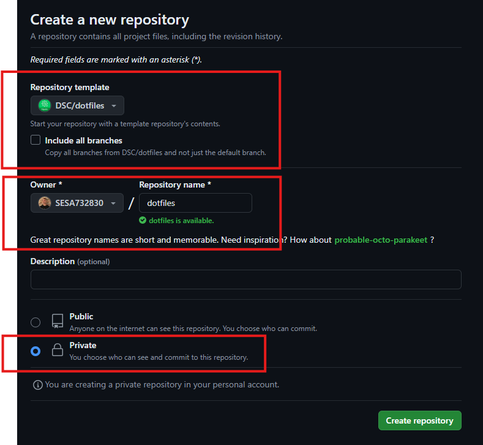

### Steps to install WSL

1. Verify WSL installation:
```powershell title="PowerShell"
wsl --list --online
```
> This command will list available Linux distributions that you can install

* Update the Linux kernel:
```powershell title="PowerShell"
wsl --update
```

* Set WSL 2 as Default Version
```powershell title="PowerShell"
wsl --set-default-version 2
```

* Install WSL distribution:
```powershell title="PowerShell"
wsl --install --distribution Ubuntu-22.04
```

> Note: Once the distribution is installed you'll be prompted to add a new user.
Fill the username with your SESA account in low letters, ex: sesa123456

An error will show if you don't follow this naming convention:
> adduser: Please enter a username matching the regular expression configured
    via the NAME_REGEX[_SYSTEM] configuration variable.  Use the `--force-badname'
    option to relax this check or reconfigure NAME_REGEX.

### Clone the DSC/dotfiles template repo

1. Create a new repo based on `DSC/dotfiles` template.

    [New Repository :octicons-repo-16:](https://github.com/organizations/mlasalmo/repositories/new){ .md-button }

    Use next image as a reference:

    

* Create a PAT with read only permission to access only the `DSC/dotfiles` repo.

    Follow next link to create a new [Fine-grained token](https://github.com/settings/personal-access-tokens/new)

* Enter the newly created distribution:
```powershell title="PowerShell"
wsl
```

* Clone `DSC/dotfiles` template repo in your GHE personal space (SESAID).
```sh
git clone https://github.com/mlasalmo/dotfiles-xpc ~/.dotfiles
```

* Generate SSH keys:
    * [Github Enterprise](https://docs.github.com/en/enterprise-server@3.14/authentication/connecting-to-github-with-ssh/generating-a-new-ssh-key-and-adding-it-to-the-ssh-agent?platform=linux#generating-a-new-ssh-key)
    * [Azure DevOps](https://learn.microsoft.com/en-us/azure/devops/repos/git/use-ssh-keys-to-authenticate?view=azure-devops#step-1-create-your-ssh-keys)

* [Generate GPG key](https://docs.github.com/en/enterprise-server@3.14/authentication/managing-commit-signature-verification/generating-a-new-gpg-key#generating-a-gpg-key)

* Install KeePassXC

> Note from KeePassXC Download page: https://keepassxc.org/download/#windows
    We have received some reports of silent crashing starting with 2.7.9.
    This is immediately fixed by reinstalling the MSVC Redistributable.

  Open a PowerShell terminal and run:

```powershell title="PowerShell"
winget install KeePassXCTeam.KeePassXC
winget install Microsoft.VCRedist.2015+.x64
```

* Save all the keys in KeePassXC

* Connect USB devices to WSL
> Optional, in case you have a Yubikey and want to add extra layer of security.

    [Microsoft Learn Documentation](https://learn.microsoft.com/en-us/windows/wsl/connect-usb)
