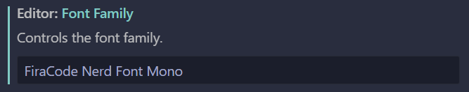
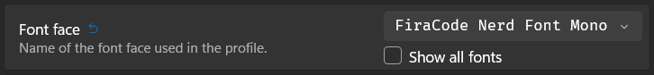

## Configuring the terminal font

This dotfiles uses the ZSH theme [Powerlevel9k](https://github.com/romkatv/powerlevel10k), so it requires you to install a font on your host machine with support for the [Nerd Fonts](https://github.com/ryanoasis/nerd-fonts) glyphs. I recommend the [`FiraCode Nerd Font Mono`](https://github.com/ryanoasis/nerd-fonts/tree/HEAD/patched-fonts/FiraCode#readme).

For **WSL** and **Ubuntu Desktop**, the dotfiles installation will automatically take care of installing the font and set it up for you in **VS Code**, **Windows Terminal** (for WSL), and **GNOME Terminal** (for Ubuntu Desktop).

On other systems or terminal emulators, **you will need to configure it manually**. Here are some tips:

### Installing the font on **Windows**

0. [Download it by clicking here](https://raw.githubusercontent.com/ryanoasis/nerd-fonts/HEAD/patched-fonts/FiraCode/Regular/FiraCodeNerdFontMono-Regular.ttf).
1. Open it and click in **_Install_**.
2. Restart any applications that you want to load the font into.

### Configuring the font in **VS Code**

0. On **VS Code**, press ++control+comma++ to open the settings.
1. Search for "**Terminal Font Family**", and write `FiraCode Nerd Font Mono` in the entry named **_Terminal › Integrated: Font Family_**. Like below:

    

### Configuring the font in **Windows Terminal**

0. On **Windows Terminal**, press ++control+comma++ to open the settings.
1. Go to **_Profiles -> Defaults_** in the left panel. Then, go to **_Additional settings -> Appearance_**.
2. At **_Text -> Font face_**, select **_FiraCode Nerd Font Mono_**. Like below:

    
