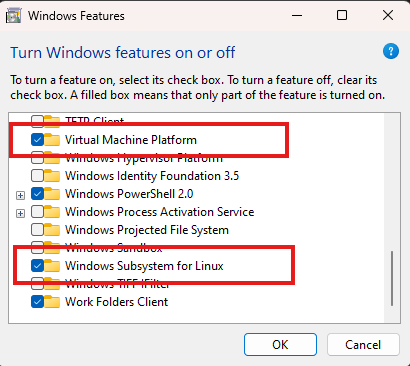

### Windows Features

1. Enable `Windows Subsystem for Linux` and `Virtual Machine Platform`

    You can enable WSL using either PowerShell or the Windows Features dialog:

    * Using PowerShell:

        Open PowerShell as an administrator (right-click and select "Run as administrator").

        Run the following command to enable VMP:
```powershell title="PowerShell"
dism.exe /online /enable-feature /featurename:VirtualMachinePlatform /all /norestart
```

        Then, enable WSL with:
```powershell title="PowerShell"
dism.exe /online /enable-feature /featurename:Microsoft-Windows-Subsystem-Linux /all /norestart
```

        Restart your computer to apply these changes:
```powershell title="PowerShell"
Restart-Computer
```

* Using Windows Features:

    Press :fontawesome-brands-windows: + ++r++ and type:
    ```sh title="Run"
    optionalfeatures
    ```

    Check the boxes for Windows Subsystem for Linux and Virtual Machine Platform, then click OK.

    

    Restart your computer.
